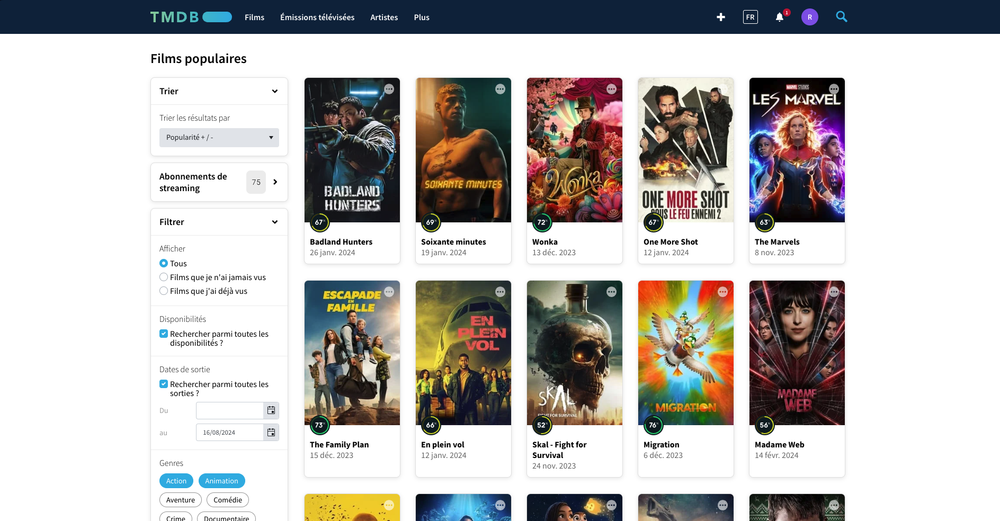
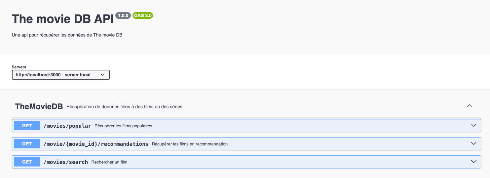

# Interface TheMovieDatabase
Interface API en Typescript pour récupérer des informations sur des films et des séries

## Installation du projet 
1. Clonnez le depot : `git clone https://github.com/RomainRamanzin/interface_themoviedb.git`
2. Intallez les dependances : `npm install`

## Configuration requise
- Clée API sur [themoviedb](https://www.themoviedb.org/)
- Node.js et npm

## Configuration de l'environnement
- Insérez votre clée API dans le fichier `.env`

## Lancement du serveur 
- npm start
- Dans sa configuration de base le serveur se lance sous `localhost:3000`
- Vous pouvez tester le serveur via l'endpoint `localhost:3000/test` qui devrait renvoyer un "Hello World"

## Exemple d'utilisation
### Rechercher un film via son titre :
- Méthode GET
- URL : `localhost:3000/movies/search`
- Paramètres : 
1. `query` (obligatoire) : le titre a rechercher
2. `language` : la langue de la recherche (par défaut fr-FR) 
3. `page` : la page a récupérer

### Récupérer les films populaires du moment :
- Méthode GET
- URL : `localhost:3000/movies/popular`
- Paramètres : 
1. `language` : la langue de la recherche (par défaut fr-FR) 
2. `page` : la page a récupérer

### Récupérer des recommandations de film par rapport à un autre film :
- Méthode GET
- URL : `localhost:3000/movies/{movie_id}/search`
- Paramètres : 
1. `movie_id` (obligatoire) : l'identifiant du film
2. `language` : la langue de la recherche (par défaut fr-FR) 
3. `page` : la page a récupérer

## Documentation complète
Vous pouvez retrouver la documentation complète via l'url suivant : `localhost:3000/api-docs`

## Contributeurs
Projet réalisé en groupe :
- [Romain Ramanzin](https://github.com/RomainRamanzin)
- [Sinan Yazici](https://github.com/sinan-yazici)